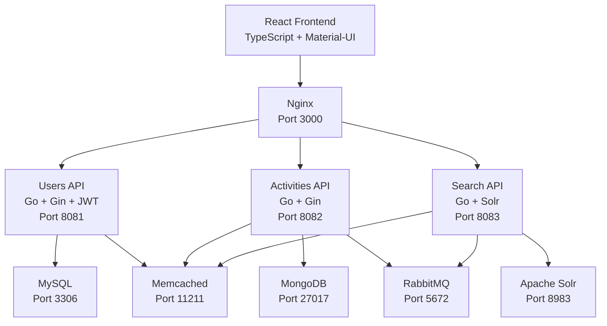

# 🏃‍♂️ Sports Activities Platform - Architecture Software II

[](https://www.docker.com/)
[](https://golang.org/)
[](https://reactjs.org/)
[](https://www.typescriptlang.org/)
[](https://www.mysql.com/)
[](https://www.mongodb.com/)

## 📋 Table of Contents

- [🏗️ Architecture](#️-architecture)
- [🚀 Quick Start](#-quick-start)
- [🐳 Docker Setup](#-docker-setup)
- [🌿 Git Flow](#-git-flow)
- [🔧 Development](#-development)
- [📡 API Endpoints](#-api-endpoints)
- [🔍 Troubleshooting](#-troubleshooting)
- [👥 Contributing](#-contributing)

## 🏗️ Architecture

### Microservices Architecture



### Services Overview

| Service | Technology | Port | Database | Description |
|---------|-----------|------|----------|-------------|
| **Frontend** | React + TypeScript | 3000 | - | User interface with Material-UI |
| **Users API** | Go + Gin + GORM | 8081 | MySQL | Authentication, user profiles, roles |
| **Activities API** | Go + Gin | 8082 | MongoDB | Sports activities management |
| **Search API** | Go + Gin | 8083 | Apache Solr | Full-text search engine |
| **MySQL** | MySQL 8.0 | 3306 | - | User data, profiles, authentication |
| **MongoDB** | MongoDB 7.0 | 27017 | - | Activities, events, sports data |
| **Apache Solr** | Solr 9.4 | 8983 | - | Search indexing and querying |
| **Memcached** | Memcached | 11211 | - | Caching layer |
| **RabbitMQ** | RabbitMQ | 5672 | - | Message queue for async tasks |

## 🚀 Quick Start

### Prerequisites

Make sure you have installed:
- [Docker](https://www.docker.com/get-started) (v20.10+)
- [Docker Compose](https://docs.docker.com/compose/install/) (v2.0+)
- [Git](https://git-scm.com/downloads)
- [pnpm](https://pnpm.io/installation) (recommended for frontend development)

### Clone and Run

```bash
# Clone the repository
git clone https://github.com/agustindt/arq-soft-II.git
cd arq-soft-II

# Switch to develop branch
git checkout develop

# Option 1: Use the start-all.sh script (recommended)
./scripts/start-all.sh

# Option 2: Use Makefile
make start

# Option 3: Use docker-compose directly
docker-compose up --build
```

🎉 **That's it!** The platform will be available at:
- **Frontend**: http://localhost:3000
- **Users API**: http://localhost:8081
- **Activities API**: http://localhost:8082
- **Search API**: http://localhost:8083

## 🐳 Docker Setup

### Development Environment

#### 1. Build and Start Services

```bash
# Build and start all services
docker-compose up --build

# Start in background (detached mode)
docker-compose up -d

# Start specific services only
docker-compose up frontend users-api mysql
```

#### 2. Individual Service Management

```bash
# Rebuild a specific service
docker-compose build users-api
docker-compose up users-api --no-deps

# View logs
docker-compose logs -f users-api
docker-compose logs --tail=50 frontend

# Stop services
docker-compose down

# Stop and remove volumes (⚠️ deletes data)
docker-compose down -v
```

#### 3. Database Setup

The databases are automatically initialized when you first run `docker-compose up`. No manual setup required!

- **MySQL**: Creates `users_db` database with user tables
- **MongoDB**: Creates `activities_db` database
- **Solr**: Creates `activities` core for search indexing

#### 4. Environment Variables

Create `.env` files if you need custom configuration:

```bash
# .env (root directory)
MYSQL_ROOT_PASSWORD=rootpassword123
MYSQL_DATABASE=users_db
MYSQL_USER=appuser
MYSQL_PASSWORD=apppassword123

# Backend environment variables
JWT_SECRET=your-super-secret-jwt-key-here
ROOT_SECRET_KEY=your-root-creation-secret
MYSQL_DSN=appuser:apppassword123@tcp(mysql:3306)/users_db?charset=utf8mb4&parseTime=True&loc=Local

# Frontend environment variables  
REACT_APP_API_URL=http://localhost:8081/api/v1
```

### Production Considerations

For production deployment:

1. **Security**: Change default passwords and secrets
2. **SSL**: Configure HTTPS with proper certificates
3. **Monitoring**: Add health checks and logging
4. **Scaling**: Use Docker Swarm or Kubernetes
5. **Backups**: Implement database backup strategies

## 🌿 Git Flow

We use **Git Flow** branching strategy for organized development:

### Branch Structure

```
main
├── develop
    ├── feature/users-api-jwt-auth
    ├── feature/activities-crud
    ├── feature/search-integration
    ├── feature/frontend-ui
    └── hotfix/critical-bug-fix
```

### Branching Rules

#### 1. **Main Branch** (`main`)
- 🚫 **Never commit directly**
- ✅ Only merge from `develop` or `hotfix/*`
- 🏷️ Tagged releases (v1.0.0, v1.1.0, etc.)
- 🚀 Production-ready code only

#### 2. **Develop Branch** (`develop`)
- 🔄 Integration branch for features
- ✅ Merge from `feature/*` branches
- 🧪 Testing and QA happens here
- 📝 Update README and documentation here

#### 3. **Feature Branches** (`feature/*`)
- 🆕 Create from `develop`
- 📝 Naming: `feature/descriptive-name`
- ✅ Merge back to `develop` via Pull Request
- 🗑️ Delete after successful merge

#### 4. **Hotfix Branches** (`hotfix/*`)
- 🚨 Critical production fixes only
- 🆕 Create from `main`
- ✅ Merge to both `main` AND `develop`

### Development Workflow

#### Starting a New Feature

```bash
# 1. Update develop branch
git checkout develop
git pull origin develop

# 2. Create feature branch
git checkout -b feature/your-feature-name

# 3. Work on your feature
git add .
git commit -m "feat: add amazing new feature"

# 4. Push feature branch
git push origin feature/your-feature-name

# 5. Create Pull Request to develop
# Use GitHub interface to create PR
```

#### Current Active Branches

| Branch | Status | Description |
|--------|--------|-------------|
| `main` | 🔒 Protected | Production releases |
| `develop` | 🔄 Active | Integration and testing |
| `feature/users-api-jwt-auth` | 🚀 In Progress | JWT authentication, extended profiles, roles |
| `feature/infrastructure-setup` | ✅ Merged | Docker setup, basic services |

### Commit Message Convention

Follow [Conventional Commits](https://www.conventionalcommits.org/):

```bash
# Features
git commit -m "feat: add user authentication system"
git commit -m "feat(api): implement JWT token refresh"

# Bug fixes  
git commit -m "fix: resolve date parsing error in profiles"
git commit -m "fix(docker): correct nginx configuration"

# Documentation
git commit -m "docs: update README with setup instructions"
git commit -m "docs(api): add endpoint documentation"

# Refactoring
git commit -m "refactor: extract user service logic"

# Performance
git commit -m "perf: optimize database queries"

# Tests
git commit -m "test: add unit tests for auth service"
```

## 🔧 Development

### Makefile Commands

We provide a comprehensive Makefile for common operations:

```bash
# Show all available commands
make help

# Main Commands
make start          # Start all services using start-all.sh
make stop           # Stop all services
make restart        # Restart all services
make build          # Build all Docker images
make logs           # Show logs from all services
make test           # Run all tests (test-all.sh)
make test-infra     # Run infrastructure tests only
make test-backend   # Run backend tests only
make seed           # Load seed data into databases
make clean          # Stop and remove containers, networks, volumes

# Service Management
make up             # Start services in detached mode
make down           # Stop and remove containers
make ps             # Show running containers
make logs-api       # Show logs from API services
make logs-db        # Show logs from database services

# Database Access
make db-mysql       # Connect to MySQL shell
make db-mongo       # Connect to MongoDB shell

# Development
make rebuild        # Rebuild all images without cache
make shell-api      # Open shell in users-api container
```

### Local Development Setup

#### Frontend Development

```bash
# Navigate to frontend
cd frontend

# Install dependencies (use pnpm)
pnpm install

# Start development server (outside Docker)
pnpm start

# Build for production
pnpm build

# Run tests
pnpm test
```

#### Backend Development (Go APIs)

```bash
# Navigate to API directory
cd backend/users-api

# Install dependencies
go mod tidy

# Run locally (requires database)
go run main.go

# Build binary
go build -o main .

# Run tests
go test ./...

# Format code
go fmt ./...
```

#### Database Management

```bash
# Connect to MySQL (users data)
docker-compose exec mysql mysql -u appuser -p users_db

# Connect to MongoDB (activities data)  
docker-compose exec mongodb mongosh activities_db

# Access Solr Admin (search management)
# Open: http://localhost:8983/solr/#/
```

### Hot Reloading

- **Frontend**: Automatic hot reload with React dev server
- **Backend**: Restart container after changes: `docker-compose restart users-api`
- **Database**: Changes persist in Docker volumes

### Testing

We provide comprehensive test scripts to verify the entire stack:

```bash
# Run all tests (infrastructure + backend + frontend + E2E)
./scripts/test-all.sh
# or
make test

# Run specific test suites
./scripts/test-infrastructure.sh  # Test databases, RabbitMQ, Solr, Memcached
# or
make test-infra

./scripts/test-backend.sh          # Test all backend APIs
# or
make test-backend

# Manual health checks
curl http://localhost:3000         # Frontend
curl http://localhost:8081/health   # Users API
curl http://localhost:8082/healthz  # Activities API  
curl http://localhost:8083/health   # Search API
curl http://localhost:8080/health   # Reservations API
```

For detailed testing documentation, see [TESTING.md](./TESTING.md).

### Seed Data

Load sample data for development and testing:

```bash
# Load seed data into MySQL and MongoDB
./scripts/seed-data.sh
# or
make seed
```

This will populate:
- **MySQL**: Test users (normal and admin roles)
- **MongoDB**: Sample activities and reservations

See `database/mysql/seed.sql` and `database/mongo/seed.js` for details.

## 📡 API Endpoints

### Users API (Port 8081)

#### Authentication Endpoints
```bash
POST   /api/v1/auth/register     # User registration
POST   /api/v1/auth/login        # User login
POST   /api/v1/auth/refresh      # Refresh JWT token
```

#### Profile Endpoints (🔒 Protected)
```bash
GET    /api/v1/profile           # Get user profile
PUT    /api/v1/profile           # Update profile
PUT    /api/v1/profile/password  # Change password
POST   /api/v1/profile/avatar    # Upload avatar
DELETE /api/v1/profile/avatar    # Delete avatar
```

#### Public User Endpoints
```bash
GET    /api/v1/users             # List users (public profiles)
GET    /api/v1/users/:id         # Get user by ID (public profile)
```

#### Admin Endpoints (🛡️ Admin Role Required)
```bash
GET    /api/v1/admin/users       # List all users (full profiles)
POST   /api/v1/admin/users       # Create new user
PUT    /api/v1/admin/users/:id/role      # Update user role
PUT    /api/v1/admin/users/:id/status    # Update user status
GET    /api/v1/admin/stats       # Get system statistics
```

#### Root Endpoints (👑 Root Role Required)
```bash
POST   /api/v1/admin/create-root # Create root user (special endpoint)
DELETE /api/v1/admin/users/:id   # Delete user (root only)
```

### Example Requests

#### Register New User
```bash
curl -X POST http://localhost:8081/api/v1/auth/register \
  -H "Content-Type: application/json" \
  -d '{
    "email": "user@example.com",
    "username": "newuser",
    "password": "securepassword123",
    "firstName": "John",
    "lastName": "Doe"
  }'
```

#### Login
```bash
curl -X POST http://localhost:8081/api/v1/auth/login \
  -H "Content-Type: application/json" \
  -d '{
    "email": "user@example.com", 
    "password": "securepassword123"
  }'
```

#### Update Profile (Protected)
```bash
curl -X PUT http://localhost:8081/api/v1/profile \
  -H "Content-Type: application/json" \
  -H "Authorization: Bearer YOUR_JWT_TOKEN" \
  -d '{
    "bio": "I love sports and fitness!",
    "location": "Buenos Aires, Argentina",
    "birth_date": "1995-06-15",
    "fitness_level": "intermediate",
    "sports_interests": "[\"football\", \"tennis\", \"running\"]"
  }'
```

### Response Format

All APIs follow consistent response format:

```json
{
  "data": {}, 
  "message": "Operation completed successfully",
  "success": true
}
```

Error responses:
```json
{
  "error": "Validation failed",
  "message": "Email is required",
  "success": false
}
```

## 🔍 Troubleshooting

### Common Issues

#### 1. Port Already in Use
```bash
# Find what's using the port
lsof -i :8081

# Kill the process
kill -9 PID

# Or use different ports in docker-compose.yml
```

#### 2. Docker Build Fails
```bash
# Clear Docker cache
docker system prune -a

# Rebuild without cache
docker-compose build --no-cache

# Check Docker disk space
docker system df
```

#### 3. Database Connection Issues
```bash
# Check if containers are running
docker-compose ps

# Check database logs
docker-compose logs mysql
docker-compose logs mongodb

# Reset databases (⚠️ deletes data)
docker-compose down -v
docker-compose up -d
```

#### 4. Frontend Build Issues
```bash
# Clear node_modules and pnpm cache
cd frontend
rm -rf node_modules
pnpm store prune
pnpm install

# Check pnpm version
pnpm --version
```

#### 5. Go Module Issues
```bash
cd backend/users-api
go clean -modcache
go mod download
go mod tidy
```

### Useful Commands

```bash
# View all running containers
docker ps

# Check container resource usage
docker stats

# Execute command in container
docker-compose exec users-api sh

# Copy files from/to container
docker cp file.txt container_name:/path/

# View container environment variables
docker-compose exec users-api env
```

### Health Checks

```bash
# Check all services health
curl http://localhost:3000                    # Frontend
curl http://localhost:8081/api/v1/health      # Users API
curl http://localhost:8082/health             # Activities API
curl http://localhost:8083/health             # Search API
curl http://localhost:8983/solr/admin/ping    # Solr
```

## 👥 Contributing

### Development Process

1. **Pick an Issue**: Check GitHub Issues or create one
2. **Create Feature Branch**: `git checkout -b feature/issue-description`
3. **Develop**: Follow coding standards and write tests
4. **Test**: Ensure all services work with `docker-compose up`
5. **Commit**: Use conventional commit messages
6. **Pull Request**: Create PR to `develop` branch
7. **Code Review**: Address feedback and get approval
8. **Merge**: Squash and merge to `develop`

### Coding Standards

#### Go (Backend)
- Follow [Go Code Review Comments](https://github.com/golang/go/wiki/CodeReviewComments)
- Use `gofmt` and `golint`
- Write unit tests for handlers
- Use structured logging
- Handle errors properly

#### TypeScript/React (Frontend)
- Follow [Airbnb Style Guide](https://github.com/airbnb/javascript/tree/master/react)
- Use TypeScript strict mode
- Write component tests with React Testing Library
- Use Material-UI components consistently
- Follow accessibility guidelines

#### Docker
- Use multi-stage builds for production
- Minimize image sizes
- Don't run as root user
- Use health checks
- Document exposed ports

### Code Review Checklist

- [ ] Code follows project conventions
- [ ] Tests are included and passing
- [ ] Documentation is updated
- [ ] Docker containers build successfully
- [ ] No sensitive data in commits
- [ ] Performance considerations addressed
- [ ] Security best practices followed

---

## 🚀 **Ready to Contribute?**

1. **Fork the repository**
2. **Clone your fork**: `git clone https://github.com/YOUR_USERNAME/arq-soft-II.git`
3. **Create feature branch**: `git checkout -b feature/amazing-feature`
4. **Start Docker**: `docker-compose up --build`
5. **Start coding**: Make your amazing contributions!
6. **Create Pull Request**: Submit to `develop` branch

---

### 📞 **Need Help?**

- 🐛 **Found a bug?** Create an [Issue](https://github.com/agustindt/arq-soft-II/issues)
- 💡 **Have an idea?** Start a [Discussion](https://github.com/agustindt/arq-soft-II/discussions)
- 📧 **Contact**: Open an issue for technical questions

---

**Happy Coding! 🎉**

*Built with ❤️ for Architecture Software II course*
